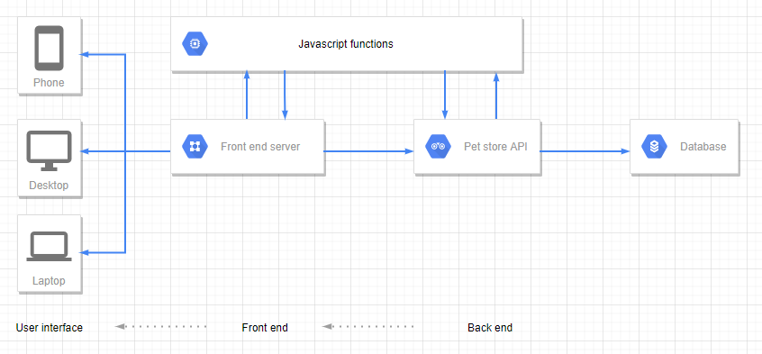
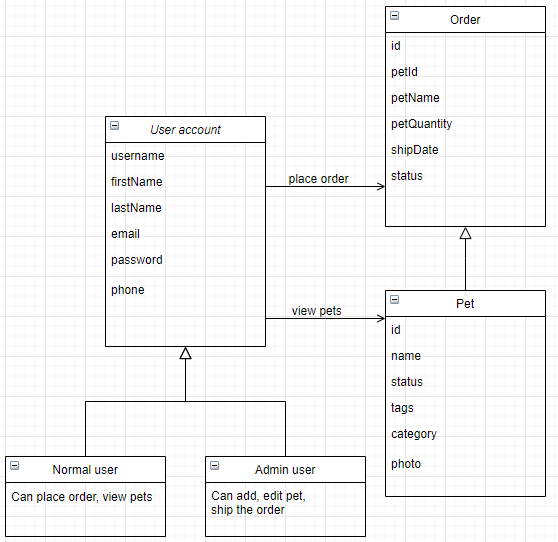
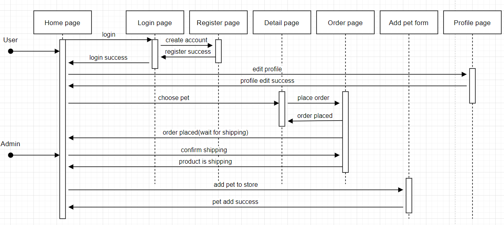

# Abstract

With the advent of the internet, increasing number of people are shopping online, in order to keep up with the changing consuming habit and to potentially reach out to a greater number of potential customers, it is important that we create an online pet shop.

The nearest pet shop in Bristol is situated at least 2 miles away from the City center, and our pet shop is also situated on the outskirts of Bristol city center, with only 1 mile less than another pet shop situated on the South-west. It is easy for those who live near our shop, they can walk in and browse, for those who live far and who are new to getting a pet, they might decide to drive in and only to find that we do not have their ideal pet in store. For this reason, a pet store might help to make their pet-choosing experience more efficient. 

	
	
Another reason for us to look slowly transforming our shop to an online one is also due to the uncertainty of the current pandemic. Even though the number of people tested positive for the virus is starting to decrease, but some might still refrain from visiting enclosed and public places unless necessary, this might be because they live with people that are more susceptible to the virus. Regardless of the reason behind their apprehension, making our online shop available would provide these potential customers a safer way to browse and shop in their own comfort, and making it a good opportunity for us, the owner to tag along with the trend of fast and efficient internet shopping.
	
We would like to make an online pet shop that is easy to navigate, and visually pleasing to soon-to-be pet owners. The primary aim is to allow customers place their order, or at least to quickly get a good idea of the pets that we offer in our store, this is because the website is designed to automatically change the status of the item/pet online once someone has placed an order. We want to provide our customers not only the convenience to shop at home, but also to help them decide whether or not they want to make a trip down to our shop for an item that is actually available in store.

# Objectives

As the owners of the pet shop, we care about the survival and sustainability of our shop. This is why we see putting our shop online as a necessary transformation to take in order to be on par with the shopping habit in recent years. Therefore the primary goal with our online shop is to provide our customers with a safe and efficient way of choosing a pet, with or without a car or pandemic (or much time).
	
In order to make sure we can kickstart our online shop and eventually make it sustainable, we need to provide our customers a pleasant shopping experience. The 'best' online pet shops listed on www.makeusof.com, all share a common characteristic, which is that they all provide a clean looking home pages with minimalistic design and layout with a set of well considered labels to guide their customers through their website. 
	
With reference to these successful cases, our objectives for this website is to make sure that it provides a pleasant and efficient experience to browse or shop in our online store, we have broken down this "pleasant and efficient experience" down to smaller chunks to help our team to achieve it. 

# System Design
## system architecture diagram

The diagram above is the system architecture diagram, which shows the overall architecture design of the pet store system.
The front-end HTML makes a request to the Pet Store API by calling the JavaScript functions. Then the pet store API will get the required data from the database and return the result through the response. After that, the front end will update the content and displays it to the user interface. 

## Class diagram

As the class diagram showed above, this pet store system has three main data models: User account model, Order model, and the Pet model.
There are two sub models under the user model which are the normal user who can view the pets and place the order, and the admin user, who can add, edit pet and confirm shipping the pet order.
## sequence diagram

The sequence diagram above shows detailed steps for users to interact with the pet shop website.
The user will first enter the home page and then go the login page to log in. If user does not have an account, the user needs to enter the registration page to create an account. When the login succeeds, the user will be navigated to the home page again. User can also edit their profile in the profile page.
After login, the user can select their favorite pet in the home page and click to enter the pet details page, in the details page, the user can place an order for the pet, and the order will be displayed as waiting for delivery in the order page.

When the administrator logs in to the website, he can confirm the delivery of the order on the order page, and the order status will change to "product is shipping". Administrators can also add new pets for sale to the home page

# Features

Here is a list of all features that our team members have thought of. You will only find a short description of the feature here, for a more detailed explanation, please click on the feature that you wish to view.

&nbsp;

<table width="1385">
<tbody>
<tr style="height: 18px;">
<td style="height: 18px;" width="225"><strong>Feature name</strong></td>
<td style="height: 18px;" width="140"><strong>Sub-features</strong></td>
<td style="height: 18px;" width="568"><strong>Description</strong>&nbsp;</td>
<td style="height: 18px;" width="381"><strong>Tasks</strong></td>
<td style="height: 18px;" width="71"><strong>Done on</strong></td>
</tr>
<tr style="height: 18px;">
<td style="height: 18px;" colspan="5" width="1385"><strong>Implemented features</strong></td>
</tr>
<tr style="height: 18px;">
<td style="height: 173px;" rowspan="8" width="225">&nbsp;&nbsp;<a href="https://github.com/Yj-nnie/web-softwaretools-plain/blob/Jun/report/Features.md#user-creation-authentication-system">User creation and authentication system</a></td>
<td style="height: 137px;" rowspan="7" width="140">User profile creation</td>
<td style="height: 137px;" rowspan="7" width="568">This allows visitors to become a registered user. They would need to enter their First and Last name, email, contact number and password.&nbsp; This feature provides three types of identified users: 1) admin 2) registered member 3) unregistered member</td>
<td style="height: 18px;" width="381">Add login and signup pages</td>
<td style="height: 18px;">31.07.21</td>
</tr>
<tr style="height: 18px;">
<td style="height: 18px;" width="381">Add International telephone plugin</td>
<td style="height: 18px;">31.07.21</td>
</tr>
<tr style="height: 18px;">
<td style="height: 18px;" width="381">Add Registration page</td>
<td style="height: 18px;">31.07.21</td>
</tr>
<tr style="height: 18px;">
<td style="height: 18px;" width="381">Add Login + Log off function</td>
<td style="height: 18px;">31.07.21</td>
</tr>
<tr style="height: 11px;">
<td style="height: 11px;" width="381">Add account name on homepage&nbsp;</td>
<td style="height: 11px;">01.08.21</td>
</tr>
<tr style="height: 18px;">
<td style="height: 18px;" width="381">Add Login button on homepage</td>
<td style="height: 18px;">01.08.21</td>
</tr>
<tr style="height: 36px;">
<td style="height: 36px;" width="381">Add access to partial functions according to user types</td>
<td style="height: 36px;">05.08.21</td>
</tr>
<tr style="height: 36px;">
<td style="height: 36px;">Update user profile</td>
<td style="height: 36px;" width="568">This feature allows user to update their info such as email, phone, password, etc. This feature is accessible for admin and logged in users.</td>
<td style="height: 36px;">Add profile page and add profile update scripts.</td>
<td style="height: 36px;">04.08.21</td>
</tr>
<tr style="height: 18px;">
<td style="height: 126px;" rowspan="5" width="225">&nbsp;<a href="https://github.com/Yj-nnie/web-softwaretools-plain/blob/Jun/report/Features.md#pet-search-display-by-categorization-and-by-availability-status">Pet search display</a></td>
<td style="height: 72px;" rowspan="3" width="140">Pet display by categories and status</td>
<td style="height: 72px;" rowspan="3" width="568">All types of users(admin, user, visitors) are able to change up what they see on the screen by selecting pet type and pet availability status.</td>
<td style="height: 18px;" width="381">Add availability status to pet items</td>
<td style="height: 18px;">02.08.21</td>
</tr>
<tr style="height: 18px;">
<td style="height: 18px;" width="381">Add pet categorization</td>
<td style="height: 18px;">02.08.21</td>
</tr>
<tr style="height: 36px;">
<td style="height: 36px;" width="381">Finalize&nbsp; the rest of each availability status pet quantity display.</td>
<td style="height: 36px;">04.08.21</td>
</tr>
<tr style="height: 18px;">
<td style="height: 54px;" rowspan="2" width="140">Homepage layout</td>
<td style="height: 54px;" rowspan="2" width="568">Home page layout with pet display and dropdown menu bar with corresponding pet category Tags</td>
<td style="height: 18px;" width="381">Initial layout and design for homepage</td>
<td style="height: 18px;">31.07.21</td>
</tr>
<tr style="height: 36px;">
<td style="height: 36px;" width="381">Finalize&nbsp; homepage layout, add a carousel and adjust layout</td>
<td style="height: 36px;">04.08.21</td>
</tr>
<tr style="height: 18px;">
<td style="height: 144px;" rowspan="6" width="225">&nbsp;<a href="https://github.com/Yj-nnie/web-softwaretools-plain/blob/Jun/report/Features.md#pet-management">Pet management</a>&nbsp;</td>
<td style="height: 36px;" rowspan="2" width="140">Add new pet</td>
<td style="height: 36px;" rowspan="2" width="568">This feature allows user to add new pets to the online inventory. This feature is only accessible for admin.</td>
<td style="height: 18px;" width="381">Initial design of 'Add page'</td>
<td style="height: 18px;">01.08.21</td>
</tr>
<tr style="height: 18px;">
<td style="height: 18px;" width="381">Modify 'Add page' to a pop-up window</td>
<td style="height: 18px;">02.08.21</td>
</tr>
<tr style="height: 18px;">
<td style="height: 36px;" rowspan="2">Update pet</td>
<td style="height: 36px;" rowspan="2" width="568">This feature allows user to update information of existing pet items. This feature is only accessible for admin.</td>
<td style="height: 18px;" width="381">Add and link up pet detail page</td>
<td style="height: 18px;">03.08.21</td>
</tr>
<tr style="height: 18px;">
<td style="height: 18px;" width="381">Add edit pet button on detail page and finalize</td>
<td style="height: 18px;">03.08.21</td>
</tr>
<tr style="height: 36px;">
<td style="height: 36px;">Delete pet</td>
<td style="height: 36px;" width="568">This feature allows user to delete existing pet items. This feature is only accessible for admin.</td>
<td style="height: 36px;" width="381">Add delete button on the top left corner of each pet display page on homepage</td>
<td style="height: 36px;">31.07.21</td>
</tr>
<tr style="height: 36px;">
<td style="height: 36px;">Upload pet image</td>
<td style="height: 36px;" width="568">This feature allows user to add a photo of a exisiting pet. This feature is only accessible for admin.</td>
<td style="height: 36px;" width="381">Set a button on detail page photo. (only appear if user is admin )</td>
<td style="height: 36px;">04.08.21</td>
</tr>
<tr style="height: 18px;">
<td style="height: 144px;" rowspan="5" width="225">&nbsp;<a href="https://github.com/Yj-nnie/web-softwaretools-plain/blob/Jun/report/Features.md#online-orders">Online orders</a></td>
<td style="height: 90px;" rowspan="4" width="140">Place orders online&nbsp;</td>
<td style="height: 90px;" rowspan="4" width="568">This feature allows user to buy an item&nbsp; from our pet store and generate orders. The access to this feature is only granted to resgistered users.</td>
<td style="height: 18px;" width="381">Add BUY NOW button on detailpage</td>
<td style="height: 18px;">02.08.21</td>
</tr>
<tr style="height: 18px;">
<td style="height: 18px;" width="381">Add Ordering Page</td>
<td style="height: 18px;">03.08.21</td>
</tr>
<tr style="height: 18px;">
<td style="height: 18px;" width="381">Add orderpage and ajusting layout</td>
<td style="height: 18px;">03.08.21</td>
</tr>
<tr style="height: 36px;">
<td style="height: 36px;" width="381">Finalize placing order&nbsp; function, including creating orders and cancelling orders.</td>
<td style="height: 36px;">03.08.21</td>
</tr>
<tr style="height: 54px;">
<td style="height: 54px;">Manage orders online</td>
<td style="height: 54px;" width="568">This feature allows admin to handle orders set by customers, including shipping products and cancelling orders. The access to this feature is only granted to admin.</td>
<td style="height: 54px;" width="381">Add owner handling orders features</td>
<td style="height: 54px;">05.08.21</td>
</tr>
<tr style="height: 18px;">
<td style="height: 18px;" colspan="5" width="1385"><strong>Dropped out Features</strong></td>
</tr>
<tr style="height: 18px;">
<td style="height: 18px;"><a href="https://github.com/Yj-nnie/web-softwaretools-plain/blob/Jun/report/Features.md#homepage-flash-cartoon">Homepage flash cartoon</a></td>
<td style="height: 18px;" width="140">N/A</td>
<td style="height: 18px;">Welcomes users with a flash cartoon whenever they load our web store</td>
<td style="height: 18px;" width="381">N/A</td>
<td style="height: 18px;" width="71">N/A</td>
</tr>
<tr style="height: 36px;">
<td style="height: 36px;"><a href="https://github.com/Yj-nnie/web-softwaretools-plain/blob/Jun/report/Features.md#personality-and-perfect-pet-match-quiz">Personality and Perfect pet quiz&nbsp;</a></td>
<td style="height: 36px;" width="140">N/A</td>
<td style="height: 36px;">A quiz that asks questions about visitors' living environment and habit to recommend the 'most suitable' pet for visitors</td>
<td style="height: 36px;" width="381">N/A</td>
<td style="height: 36px;" width="71">N/A</td>
</tr>
</tbody>
</table>

