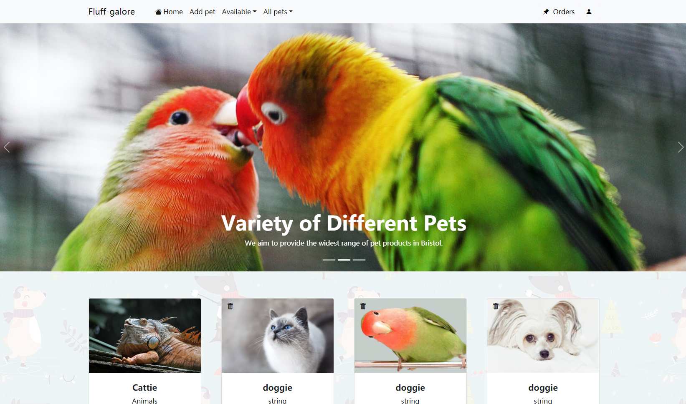
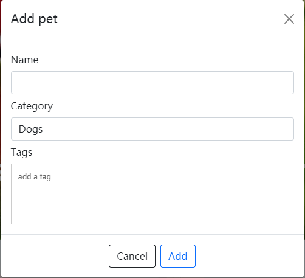
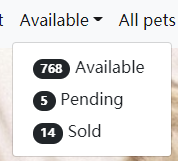
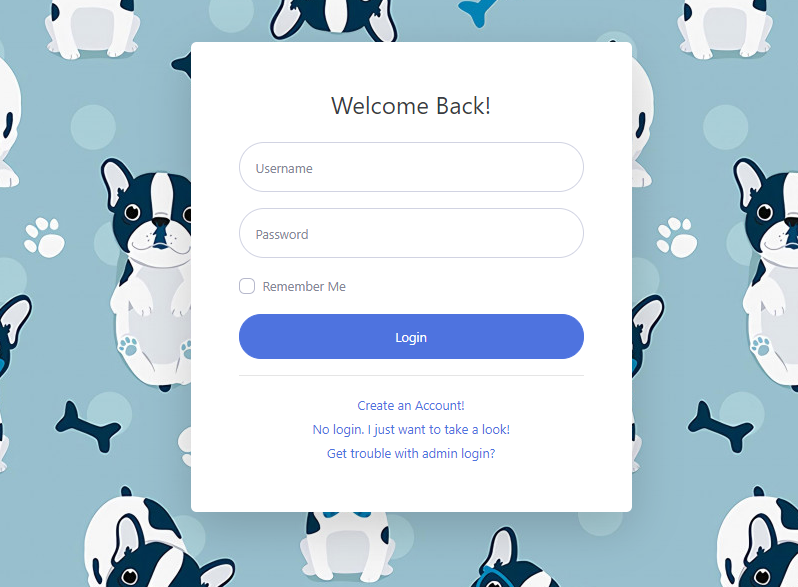
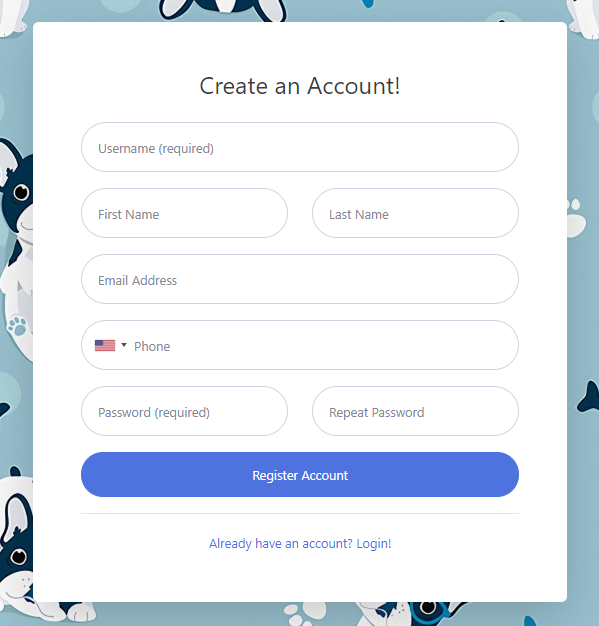
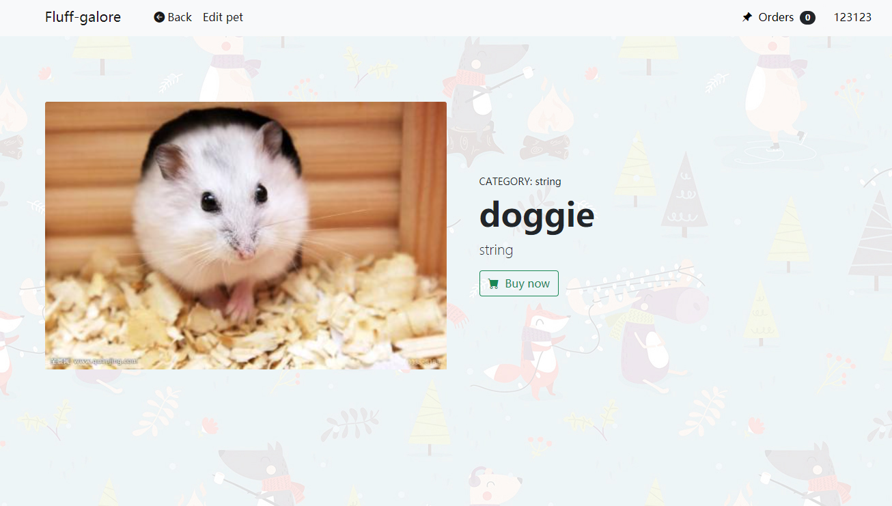
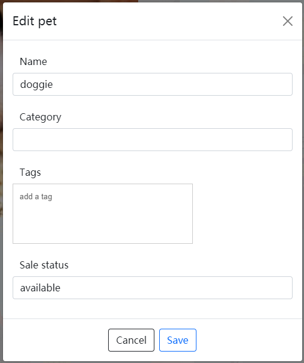
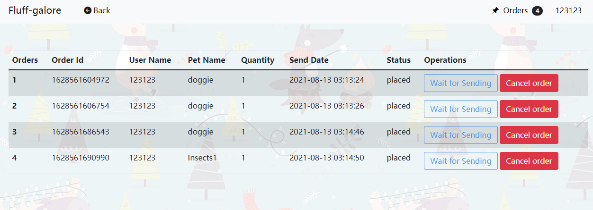
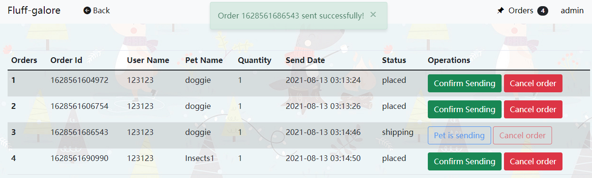
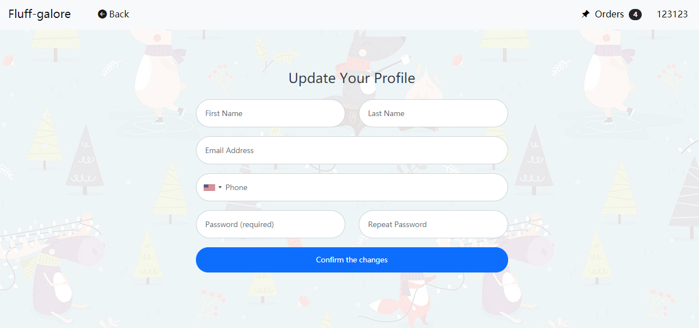

# UX Development

# Final UX
## Introduction
This part mainly describes the final design of the pet store web page, specific function in each page. The main function description and code implementation of each feature.

## Home page

<p align="center">

</p>

The figure above is the home page of the pet store. The main function of the home page is to display the list of pets in the pet store. The navigation bar at the top allows the administrator to add pets, and users can classify and view pets in different states and types. The upper right corner of the navigation bar has a button to access the order page or login page.

### Pet list display

The function to require the pet list data from the pet store API:
```js
const getPetsUrl = 'https://petstore.swagger.io/v2/pet/findByStatus?status=' + status;

    fetch(getPetsUrl, {headers: {'Content-Type': 'application/json'}})
        .then((response) => response.json())
        .then((pets) => {
            let petsHTML = '';

            pets.forEach((pet) => {
                if (pet.hasOwnProperty("category")) {
                    if (pet.category.hasOwnProperty("name")) {

                        let petTags = '';
                        let buttonHTML = '';

                        if (status === "pending")
                            buttonHTML += '<a class="btn btn-warning mt-auto disabled" href="#">PENDING</a>';
                        else if (status === "sold")
                            buttonHTML += '<a class="btn btn-danger mt-auto disabled" href="#">SOLD</a>';

                        if (Array.isArray(pet.tags)) {
                            pet.tags.forEach((tag) => {
                                if (
                                    typeof tag === 'object' &&
                                    tag !== null &&
                                    Object.prototype.hasOwnProperty.call(tag, 'name') &&
                                    typeof tag.name === 'string') {
                                    petTags += petListObjectTagTemplate.replace('PET_TAG_WILL_GO_HERE', tag.name)
                                }
                            });
                        }

                        let petHTML = petListObjectTemplate;
                        let categoryHTML = '<p hidden>' + pet.category.name + '</p>'
                        // We use the regular expression in this case to cover multiple occurrences in text.
                        petHTML = petHTML.replace(/PET_ID_WILL_GO_HERE/g, pet.id)
                        petHTML = petHTML.replace('PET_NAME_WILL_GO_HERE', pet.name)
                        petHTML = petHTML.replace('PET_TAGS_WILL_GO_HERE', petTags)
                        petHTML = petHTML.replace('BUY_BUTTON_STATUS', buttonHTML)
                        petHTML = petHTML.replace('PET_CATEGORY_WILL_GO_HERE', categoryHTML)
                        // Random images
                        let imageNum = Math.floor(Math.random()*10).toString();
                        petHTML = petHTML.replace('IMAGE_NUM', imageNum)

                        petsHTML += petHTML;
                    }
                }
            })
```

The pet list template to be replaced:

```html
const petListObjectTemplate = `
      <div class="col mb-5 pet-display" id="PET_ID_WILL_GO_HERE">PET_CATEGORY_WILL_GO_HERE
        <div class="card h-100">
          <!-- Product image-->
          
          <button class="btn" style="position: absolute" onClick="handleDelete(PET_ID_WILL_GO_HERE)">
            <i class="bi-trash-fill me-1"></i>
          </button>
          <!-- Product details-->
          <div class="card-body p-4" onclick="openDetail(this)" style="cursor: pointer">
            <div class="text-center">
            <!-- Product name-->
            <h5 class="fw-bolder">PET_NAME_WILL_GO_HERE</h5>
            <!-- Product price-->
            PET_TAGS_WILL_GO_HERE
            </div>
          </div>
          <!-- Product actions-->
            BUY_BUTTON_STATUS
        </div>
      </div>
    `;
```
When a response is obtained from the pet store API, the pet list template is replaced with specific pet data and displayed on the home page.
The user can select the category and status of the pet in the upper navigation bar. The user's selection will change the parameter in the function, and the corresponding pet list will be refreshed on the home page.

### Add pet form

<p align="center">

</p>

When the administrator enters specific pet information and clicks the add button. A request will send to the pet store API using the POST method with the pet information.

```js
const postPetUrl = 'https://petstore.swagger.io/v2/pet'
fetch(postPetUrl, {
    headers: {'Content-Type': 'application/json'},
    method: 'POST',
    body: JSON.stringify({
        "id": new Date().getTime(),
        "name": name,
        "category": {
            "id": 0,
            "name": category
        },
        "tags": tagsArr,
        "status": status
    })
}).then((response) => response.json())
```

### Inventory status

<p align="center">

</p>

The queryStatusQuantity function gets the data from the pet store inventory API and display the data next to the corresponding state.

```js
function queryStatusQuantity() {
    $.ajax({
        url: "https://petstore.swagger.io/v2/store/inventory",
        type: "GET",
        success: function (data){
            console.log(data);
            document.getElementById("availableQuantity").innerText = data["available"];
            document.getElementById("pendingQuantity").innerText = data["pending"];
            document.getElementById("soldQuantity").innerText = data["sold"];
        },
        error: function (error) {
            console.log(error.responseJSON);
        }
    });
}
```

## Login page

<p align="center">

</p>

The figure above shows the login page of the pet store. Users can enter the account and password on this page for login, or go to the registration page for account registration.

### Login

This function is to send the input of username and password to the API to let user login.
```js
const username = $("#exampleInputUsername").val()
const password = $("#exampleInputPassword").val()
    $.ajax({
        url: "https://petstore.swagger.io/v2/user/login?username=" + username
            + '&' + "password=" + password,
        type: "GET",
        async: false,
        cache: false,
        success: function (data) {
            console.log(data);
            Storage.set("username", username, 21600);
            bs4pop.notice('Login success!', {type: 'success'});
            setTimeout('window.location.replace("index.html")',1000);
        },
        error: function (error) {
            console.log(error.responseJSON);
            alert("Login failed!")
        }
    });
```

### Admin password remind

Due to the shared petstore API, other resit groups may change the admin password. This is the function to give the hint of the admin password.

```js
function getAdminPassword() {
    let element = $("#pwdHint");
    if (element) element.remove();
    $.ajax({
        url: "https://petstore.swagger.io/v2/user/admin",
        type: "GET",
        async: false,
        cache: false,
        success: function (data){
            $("#passwordHint").after("<p id='pwdHint'>The <b>admin</b>'s password is " +
                "<b style='color: red'>" + data.password + "</b></p>")
        },
        error: function (error) {
            $("#passwordHint").after("<p><b id='pwdHint' style='color: red'>" +
                error.responseJSON.message + ".</b></p>")
        }
    });
}
```
## Register page

<p align="center">

</p>

The figure above shows the register page of the pet store. User can enter the information and create the account in this page.

### Account registration

The function below is the function to call the pet store API and create the user account.

```js
const dataArray = [];
const dataJson = {
    "username": $("#exampleInputUsername").val(),
    "firstName": $("#exampleFirstName").val(),
    "lastName": $("#exampleLastName").val(),
    "email": $("#exampleInputEmail").val(),
    "password": $("#exampleInputPassword").val(),
    "phone": $("#exampleInputPhone").val()
};
dataArray.push(dataJson);

$.ajax({
    url: "https://petstore.swagger.io/v2/user/createWithArray",
    type: "POST",
    async: false,
    cache: false,
    dataType: "json",
    contentType: "application/json",
    traditional: true,
    data: JSON.stringify(dataArray),
    success: function (data) {
        console.log(data);
        Storage.set("username", dataJson.username, 21600);
        Storage.set("password", dataJson.password, 21600);
        alert("You have successfully registered!");
        window.location.replace("login.html");
    },
    error: function (error) {
        console.log(error.responseJSON);
        alert("Registration failed!")
    }
});
```

## Detail page

<p align="center">

</p>

The figure above shows the pet details page of the pet store. In this page, the user can place an order for the pet, and the administrator can modify the information of the pet.

### Place order
This function is to send request to the pet store API to place the order for the chosen pet:
```js
function placeOrder() {
    let user = Storage.get("username");
    if (user) {
        if (confirm("Are you sure to purchase?")) {
            let date = new Date().getTime()
            let obj = {};
            obj = {
                id: date,
                petId: parseInt(getUrlParam("id")),
                petName: getUrlParam("name"),
                petQuantity: 1,
                // Delay for 3 days(259200000 milliseconds) as shipping time.
                shipDate: new Date(date + 259200000).Format('yy-MM-dd hh:mm:ss'),
                status: "placed"
            }
            let orders = Storage.get(user);
            if (orders) {
                orders.push(obj);
                Storage.set(user, orders, 21600);
            } else {
                let orderArr = [];
                orderArr.push(obj);
                Storage.set(user, orderArr, 21600);
            }
            updatePetStatus(obj.id, "pending");
            bs4pop.notice("Purchase success! The order id is " + obj.id + '.', {type: 'success'});
            displayOrderQuantity()
        }
    }
    else isLogin()
}
```

### Edit pet

<p align="center">

</p>

Administrator can edit the pet information through this form. The function will replace the pet information with the new pet information entered by the administrator.
```js
if (isAdminLogin()) {
        $("#petStatus").attr("disabled", true);
    }

let petName = getUrlParam("name");
let petTags = getUrlParam("tags");
let petCategory = getUrlParam("category");
let petStatus = getUrlParam("status");
let petImage = getUrlParam("image");

document.getElementById("petName").innerText = petName;
document.getElementById("petTags").innerText = petTags;
document.getElementById("petCategory").innerText = petCategory;

$("#detailImage").attr('src', petImage);
$("#nameInput").val(petName);
$("#categoryInput").val(petCategory);
$("#statusInput").val(petStatus);
```

## Order page

<p align="center">

</p>

The figure above shows the order page of the pet store. This page can display the order of the pet, including the status and details of the order. When the administrator enters the order page, they can confirm sending the pet order.

### Order display

The order template to be filled with detail information:
```html
const ordersTableTemplate = `
        <tr id="ORDER_ID">
            <th scope="row">SERIAL_NUM</th>
            <td>ORDER_ID</td>
            <td>USER_NAME</td>
            <td>PET_NAME</td>
            <td>QUANTITY</td>
            <td>SHIP_DATE</td>
            <td>STATUS</td>
            <td><button class="btn CONFIRM_BUTTON_STYLE" onClick="ORDER_PROCESS(ORDER_ID)">CONFIRM_BUTTON_TEXT</button>
                <button class="btn DELETE_BUTTON_STYLE" onClick="cancelOrder(ORDER_ID)">Cancel order</button>
            </td>
        </tr>
    `;
```
Function to display the order information:
```js
$(function () {
    if (document.getElementById("orderTable")) {
        if (isAdminLogin()) {
            adminRenderTable(ordersTableTemplate);
        } else {
            if (isExistOrdersForUser()) {
                let username = Storage.get("username");
                let ordersData = Storage.get(username);
                let count = 1;
                let ordersHTML = '';

                ordersData.forEach((order) => {
                    let orderHTML = ordersTableTemplate;
                    orderHTML = orderHTML.replace(/SERIAL_NUM/g, count)
                    orderHTML = orderHTML.replace(/USER_NAME/g, username)
                    orderHTML = orderHTML.replace(/ORDER_PROCESS/g, "completeOrder")
                    orderHTML = orderHTML.replace(/ORDER_ID/g, order.id)
                    orderHTML = orderHTML.replace(/PET_NAME/g, order.petName)
                    orderHTML = orderHTML.replace(/QUANTITY/g, order.petQuantity)
                    orderHTML = orderHTML.replace(/SHIP_DATE/g, order.shipDate)
                    orderHTML = orderHTML.replace(/STATUS/g, order.status)
                    if (order.status === "placed") {
                        orderHTML = orderHTML.replace(/CONFIRM_BUTTON_TEXT/g, "Wait for Sending")
                        orderHTML = orderHTML.replace(/CONFIRM_BUTTON_STYLE/g, "btn-outline-primary disabled")
                        orderHTML = orderHTML.replace(/DELETE_BUTTON_STYLE/g, "btn-danger")
                    } else {
                        orderHTML = orderHTML.replace(/CONFIRM_BUTTON_TEXT/g, "Confirm receipt")
                        orderHTML = orderHTML.replace(/CONFIRM_BUTTON_STYLE/g, "btn-success")
                        orderHTML = orderHTML.replace(/DELETE_BUTTON_STYLE/g, "btn-outline-danger disabled")
                    }

                    count++;
                    ordersHTML += orderHTML;
                })

                document.getElementById("orderTable").innerHTML = ordersHTML;
            }
        }
    }
});
```

### Send order

<p align="center">

</p>

the function for administrator to send the pet order:
```js
function shipOrder(id) {
    if (confirm("Please confirm once again that you have packed and sent it successfully.")) {
        for (let i = 0; i < localStorage.length; i++) {
            let key = localStorage.key(i);
            if (key !== "username") {
                let ordersData = Storage.get(key);
                for (let j = 0; j < ordersData.length; j++) {
                    if (id === ordersData[j].id) {
                        ordersData[j].status = "shipping";
                    }
                }
                Storage.set(key, ordersData, 21600);
            }
        }
        updatePetStatus(id, "sold");
        adminRenderTable(ordersTableTemplate);
        bs4pop.notice('Order ' + id + ' sent successfully!',{type:'success'})
    }
}
```


## Profile page

<p align="center">

</p>

The figure above is the pet store's user profile page. On this page, users can change their user information and password.

### Update profile
This function passes the updated user data to the pet store API to update user's profile.
pwdCheck() is to check whether the two input passwords are the same and valid.
```js
$(function () {
    $('#form').on('submit', function (e) {
        e.preventDefault();

        if (pwdCheck()) {
            let username = Storage.get("username");
            let dataJson = {
                "id": 0,
                "username": username,
                "firstName": $("#exampleFirstName").val(),
                "lastName": $("#exampleLastName").val(),
                "email": $("#exampleInputEmail").val(),
                "password": $("#exampleInputPassword").val(),
                "phone": $("#exampleInputPhone").val(),
                "userStatus": 0
            };

            $.ajax({
                url: "https://petstore.swagger.io/v2/user/" + username,
                type: "PUT",
                async: false,
                cache: false,
                dataType: "json",
                contentType: "application/json",
                traditional: true,
                data: JSON.stringify(dataJson),
                success: function (data) {
                    console.log(data);
                    alert("You have successfully updated!");
                    window.location.reload();
                },
                error: function (error) {
                    console.log(error.responseJSON);
                    alert("Update failed!")
                }
            });
        }
    });
});
```

# Design Choices

# Evaluation 
