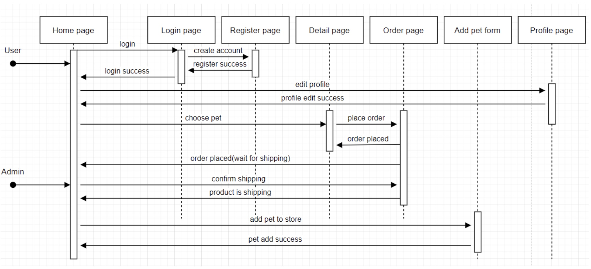

# UX Development:

## Design Process

<div align=center>


_Figure 1: The design process_
</div>

This is [the list of our design tasks](https://github.com/Yj-nnie/web-softwaretools-plain/blob/dlh8899/UX/task.md).

## Prototyping 

### Objectives

For the project, our initial idea involved creating a login page, which was convienient for user to manage their own accounts. After the first discussion, we should achieve:

* Creating the initial prototype in order to give a direction for development
* Making the features of site
* Figure out what the customer needs

<div align=center>


_Figure 2: The initial wireframe_
</div>


The creation of this wireframe also allowed us to clarify what feature we should achieve further, namely:

* The login page for user (manage their own account)
* The categories of pets (make the site more clear)
* The function of shooping cart (make user see what they choose at the moment)

Based on the above deign choices, we decided to make the first survey for users. The final design scheme is decided according to the user feedback, including the layout of the site, site features and site improvements. This is our [first survey]().

## The prototype implemention

After the first survey, we focused on developing it along with above user feedback, which further aided us in implemting a user centric methodology. We did the paper prototype in more detail to show all features of the site, including logging in, placing the order and classifying by pets species, and the front end develop the layout of the whole website. We decided to represent this paper prototype to users and gather their feedback to develop the website. This is the [second survey]().

### Objectives

* Determine the style of the site among possible design choices
* Make the layout of the site clear
* The paper prototype should be coherent

### The system flow of the prototype

<div align=center>


_Figure 3: The paper prototype representing our idea_
</div>

## Users and Stakeholders

The first thing we wanted to do is to understand the lives and circumstances of the people our project will affect - as much as possible. We should focus on the user needs and then develop the website according to their feedback. In the meanwhile, stakeholeder needs are as critical. We are supposed to understand their needs, processes, frustrations and ideas. We restricted the scope to the following users and stakeholders:

* The development team (our group)
* Customers who want to buy pets
* A pet shop owner who sells pets

In order to help us further develop, we drew up two personas - a customer persona and a shop owner persona. This group is our priority target user group, therefore, we should process our user experience and website design based on these personas.

<div align=center>


_Figure 4: The customer persona_


_Figure 5: The pet owner persona_
</div>

# Final UX

## System Flow

<div align=center>


_Figure 6: The final system flow_
</div>

There are two different account for users: customers and adminstrator. For customers, they will go through the following process:

* Go to the login page from the home page (if not, they still can look through the details of pets, but cannot place order)
* Go to the register page if not have an account
* Create their own account
* Go back to Login page and login
* Click the tag of available or all pets to see the categories of pets
* Click the prefer pet and go to the detail page 
* Click buy in the detail page and place order
* Click order to go to the oder page and display all pets in order
* Addition: users can go to the profile page at any time to modify their personnal information

This is [the video](https://www.youtube.com/watch?v=FyJyXnCKCiw) to show the customer process.

For administrator, they will go through the following process:

* Log in the admin account at the log in page
* Click order to see the state of the order
* Click send to deliver the pet
* Click delete to delete the selling pet
* Click add pet to add new pets

This is [the video](https://www.youtube.com/watch?v=Up0Bc-CfWkY) to show the administrator process.


## Homepage

<div align=center>


_Figure 7: The Homepage_
</div>

The figure above is the home page of the pet store. The main function of the home page is to display the list of pets in the pet store. The navigation bar at the top allows the administrator to add pets, and users can classify and view pets in different states and types. The upper right corner of the navigation bar has a button to access the order page or login page.

### Pet list display

The function to require the pet list data from the pet store API:
```js
const getPetsUrl = 'https://petstore.swagger.io/v2/pet/findByStatus?status=' + status;

    fetch(getPetsUrl, {headers: {'Content-Type': 'application/json'}})
        .then((response) => response.json())
        .then((pets) => {
            let petsHTML = '';

            pets.forEach((pet) => {
                if (pet.hasOwnProperty("category")) {
                    if (pet.category.hasOwnProperty("name")) {

                        let petTags = '';
                        let buttonHTML = '';

                        if (status === "pending")
                            buttonHTML += '<a class="btn btn-warning mt-auto disabled" href="#">PENDING</a>';
                        else if (status === "sold")
                            buttonHTML += '<a class="btn btn-danger mt-auto disabled" href="#">SOLD</a>';

                        if (Array.isArray(pet.tags)) {
                            pet.tags.forEach((tag) => {
                                if (
                                    typeof tag === 'object' &&
                                    tag !== null &&
                                    Object.prototype.hasOwnProperty.call(tag, 'name') &&
                                    typeof tag.name === 'string') {
                                    petTags += petListObjectTagTemplate.replace('PET_TAG_WILL_GO_HERE', tag.name)
                                }
                            });
                        }

                        let petHTML = petListObjectTemplate;
                        let categoryHTML = '<p hidden>' + pet.category.name + '</p>'
                        // We use the regular expression in this case to cover multiple occurrences in text.
                        petHTML = petHTML.replace(/PET_ID_WILL_GO_HERE/g, pet.id)
                        petHTML = petHTML.replace('PET_NAME_WILL_GO_HERE', pet.name)
                        petHTML = petHTML.replace('PET_TAGS_WILL_GO_HERE', petTags)
                        petHTML = petHTML.replace('BUY_BUTTON_STATUS', buttonHTML)
                        petHTML = petHTML.replace('PET_CATEGORY_WILL_GO_HERE', categoryHTML)
                        // Random images
                        let imageNum = Math.floor(Math.random()*10).toString();
                        petHTML = petHTML.replace('IMAGE_NUM', imageNum)

                        petsHTML += petHTML;
                    }
                }
            })
```

The pet list template to be replaced:

```html
const petListObjectTemplate = `
      <div class="col mb-5 pet-display" id="PET_ID_WILL_GO_HERE">PET_CATEGORY_WILL_GO_HERE
        <div class="card h-100">
          <!-- Product image-->
          
          <button class="btn" style="position: absolute" onClick="handleDelete(PET_ID_WILL_GO_HERE)">
            <i class="bi-trash-fill me-1"></i>
          </button>
          <!-- Product details-->
          <div class="card-body p-4" onclick="openDetail(this)" style="cursor: pointer">
            <div class="text-center">
            <!-- Product name-->
            <h5 class="fw-bolder">PET_NAME_WILL_GO_HERE</h5>
            <!-- Product price-->
            PET_TAGS_WILL_GO_HERE
            </div>
          </div>
          <!-- Product actions-->
            BUY_BUTTON_STATUS
        </div>
      </div>
    `;
```
When a response is obtained from the pet store API, the pet list template is replaced with specific pet data and displayed on the home page.
The user can select the category and status of the pet in the upper navigation bar. The user's selection will change the parameter in the function, and the corresponding pet list will be refreshed on the home page.

### Add pet form

<div align="center">


_Figure 8: Add pet form_
</div>

When the administrator enters specific pet information and clicks the add button. A request will send to the pet store API using the POST method with the pet information.

```js
const postPetUrl = 'https://petstore.swagger.io/v2/pet'
fetch(postPetUrl, {
    headers: {'Content-Type': 'application/json'},
    method: 'POST',
    body: JSON.stringify({
        "id": new Date().getTime(),
        "name": name,
        "category": {
            "id": 0,
            "name": category
        },
        "tags": tagsArr,
        "status": status
    })
}).then((response) => response.json())
```

### Inventory status

<div align="center">


_Figure 9: Inventory Status_
</div>

The queryStatusQuantity function gets the data from the pet store inventory API and display the data next to the corresponding state.

```js
function queryStatusQuantity() {
    $.ajax({
        url: "https://petstore.swagger.io/v2/store/inventory",
        type: "GET",
        success: function (data){
            console.log(data);
            document.getElementById("availableQuantity").innerText = data["available"];
            document.getElementById("pendingQuantity").innerText = data["pending"];
            document.getElementById("soldQuantity").innerText = data["sold"];
        },
        error: function (error) {
            console.log(error.responseJSON);
        }
    });
}
```

## Login page

<div align="center">


_Figure 10: Login page_
</div>

The figure above shows the login page of the pet store. Users can enter the account and password on this page for login, or go to the registration page for account registration.

### Login

This function is to send the input of username and password to the API to let user login.
```js
const username = $("#exampleInputUsername").val()
const password = $("#exampleInputPassword").val()
    $.ajax({
        url: "https://petstore.swagger.io/v2/user/login?username=" + username
            + '&' + "password=" + password,
        type: "GET",
        async: false,
        cache: false,
        success: function (data) {
            console.log(data);
            Storage.set("username", username, 21600);
            bs4pop.notice('Login success!', {type: 'success'});
            setTimeout('window.location.replace("index.html")',1000);
        },
        error: function (error) {
            console.log(error.responseJSON);
            alert("Login failed!")
        }
    });
```

### Admin password remind

Due to the shared petstore API, other resit groups may change the admin password. This is the function to give the hint of the admin password.

```js
function getAdminPassword() {
    let element = $("#pwdHint");
    if (element) element.remove();
    $.ajax({
        url: "https://petstore.swagger.io/v2/user/admin",
        type: "GET",
        async: false,
        cache: false,
        success: function (data){
            $("#passwordHint").after("<p id='pwdHint'>The <b>admin</b>'s password is " +
                "<b style='color: red'>" + data.password + "</b></p>")
        },
        error: function (error) {
            $("#passwordHint").after("<p><b id='pwdHint' style='color: red'>" +
                error.responseJSON.message + ".</b></p>")
        }
    });
}
```
## Register page

<div align="center">


_Figure 11: Register page_

</div>

The figure above shows the register page of the pet store. User can enter the information and create the account in this page.

### Account registration

The function below is the function to call the pet store API and create the user account.

```js
const dataArray = [];
const dataJson = {
    "username": $("#exampleInputUsername").val(),
    "firstName": $("#exampleFirstName").val(),
    "lastName": $("#exampleLastName").val(),
    "email": $("#exampleInputEmail").val(),
    "password": $("#exampleInputPassword").val(),
    "phone": $("#exampleInputPhone").val()
};
dataArray.push(dataJson);

$.ajax({
    url: "https://petstore.swagger.io/v2/user/createWithArray",
    type: "POST",
    async: false,
    cache: false,
    dataType: "json",
    contentType: "application/json",
    traditional: true,
    data: JSON.stringify(dataArray),
    success: function (data) {
        console.log(data);
        Storage.set("username", dataJson.username, 21600);
        Storage.set("password", dataJson.password, 21600);
        alert("You have successfully registered!");
        window.location.replace("login.html");
    },
    error: function (error) {
        console.log(error.responseJSON);
        alert("Registration failed!")
    }
});
```

## Detail page

<div align="center">


_Figure 12: Detail page_
</div>

The figure above shows the pet details page of the pet store. In this page, the user can place an order for the pet, and the administrator can modify the information of the pet.

### Place order
This function is to send request to the pet store API to place the order for the chosen pet:
```js
function placeOrder() {
    let user = Storage.get("username");
    if (user) {
        if (confirm("Are you sure to purchase?")) {
            let date = new Date().getTime()
            let obj = {};
            obj = {
                id: date,
                petId: parseInt(getUrlParam("id")),
                petName: getUrlParam("name"),
                petQuantity: 1,
                // Delay for 3 days(259200000 milliseconds) as shipping time.
                shipDate: new Date(date + 259200000).Format('yy-MM-dd hh:mm:ss'),
                status: "placed"
            }
            let orders = Storage.get(user);
            if (orders) {
                orders.push(obj);
                Storage.set(user, orders, 21600);
            } else {
                let orderArr = [];
                orderArr.push(obj);
                Storage.set(user, orderArr, 21600);
            }
            updatePetStatus(obj.id, "pending");
            bs4pop.notice("Purchase success! The order id is " + obj.id + '.', {type: 'success'});
            displayOrderQuantity()
        }
    }
    else isLogin()
}
```

### Edit pet

<div align="center">


_Figure 13: Edit page_
</div>

Administrator can edit the pet information through this form. The function will replace the pet information with the new pet information entered by the administrator.
```js
if (isAdminLogin()) {
        $("#petStatus").attr("disabled", true);
    }

let petName = getUrlParam("name");
let petTags = getUrlParam("tags");
let petCategory = getUrlParam("category");
let petStatus = getUrlParam("status");
let petImage = getUrlParam("image");

document.getElementById("petName").innerText = petName;
document.getElementById("petTags").innerText = petTags;
document.getElementById("petCategory").innerText = petCategory;

$("#detailImage").attr('src', petImage);
$("#nameInput").val(petName);
$("#categoryInput").val(petCategory);
$("#statusInput").val(petStatus);
```

## Order page

<div align="center">


_Figure 14: Order page_
</div>

The figure above shows the order page of the pet store. This page can display the order of the pet, including the status and details of the order. When the administrator enters the order page, they can confirm sending the pet order.

### Order display

The order template to be filled with detail information:
```html
const ordersTableTemplate = `
        <tr id="ORDER_ID">
            <th scope="row">SERIAL_NUM</th>
            <td>ORDER_ID</td>
            <td>USER_NAME</td>
            <td>PET_NAME</td>
            <td>QUANTITY</td>
            <td>SHIP_DATE</td>
            <td>STATUS</td>
            <td><button class="btn CONFIRM_BUTTON_STYLE" onClick="ORDER_PROCESS(ORDER_ID)">CONFIRM_BUTTON_TEXT</button>
                <button class="btn DELETE_BUTTON_STYLE" onClick="cancelOrder(ORDER_ID)">Cancel order</button>
            </td>
        </tr>
    `;
```
Function to display the order information:
```js
$(function () {
    if (document.getElementById("orderTable")) {
        if (isAdminLogin()) {
            adminRenderTable(ordersTableTemplate);
        } else {
            if (isExistOrdersForUser()) {
                let username = Storage.get("username");
                let ordersData = Storage.get(username);
                let count = 1;
                let ordersHTML = '';

                ordersData.forEach((order) => {
                    let orderHTML = ordersTableTemplate;
                    orderHTML = orderHTML.replace(/SERIAL_NUM/g, count)
                    orderHTML = orderHTML.replace(/USER_NAME/g, username)
                    orderHTML = orderHTML.replace(/ORDER_PROCESS/g, "completeOrder")
                    orderHTML = orderHTML.replace(/ORDER_ID/g, order.id)
                    orderHTML = orderHTML.replace(/PET_NAME/g, order.petName)
                    orderHTML = orderHTML.replace(/QUANTITY/g, order.petQuantity)
                    orderHTML = orderHTML.replace(/SHIP_DATE/g, order.shipDate)
                    orderHTML = orderHTML.replace(/STATUS/g, order.status)
                    if (order.status === "placed") {
                        orderHTML = orderHTML.replace(/CONFIRM_BUTTON_TEXT/g, "Wait for Sending")
                        orderHTML = orderHTML.replace(/CONFIRM_BUTTON_STYLE/g, "btn-outline-primary disabled")
                        orderHTML = orderHTML.replace(/DELETE_BUTTON_STYLE/g, "btn-danger")
                    } else {
                        orderHTML = orderHTML.replace(/CONFIRM_BUTTON_TEXT/g, "Confirm receipt")
                        orderHTML = orderHTML.replace(/CONFIRM_BUTTON_STYLE/g, "btn-success")
                        orderHTML = orderHTML.replace(/DELETE_BUTTON_STYLE/g, "btn-outline-danger disabled")
                    }

                    count++;
                    ordersHTML += orderHTML;
                })

                document.getElementById("orderTable").innerHTML = ordersHTML;
            }
        }
    }
});
```

### Send order

<div align="center">


_Figure 15: Send Order page_
</div>

the function for administrator to send the pet order:
```js
function shipOrder(id) {
    if (confirm("Please confirm once again that you have packed and sent it successfully.")) {
        for (let i = 0; i < localStorage.length; i++) {
            let key = localStorage.key(i);
            if (key !== "username") {
                let ordersData = Storage.get(key);
                for (let j = 0; j < ordersData.length; j++) {
                    if (id === ordersData[j].id) {
                        ordersData[j].status = "shipping";
                    }
                }
                Storage.set(key, ordersData, 21600);
            }
        }
        updatePetStatus(id, "sold");
        adminRenderTable(ordersTableTemplate);
        bs4pop.notice('Order ' + id + ' sent successfully!',{type:'success'})
    }
}
```


## Profile page

<div align="center">


_Figure 16: Profile page_
</div>

The figure above is the pet store's user profile page. On this page, users can change their user information and password.

### Update profile
This function passes the updated user data to the pet store API to update user's profile.
pwdCheck() is to check whether the two input passwords are the same and valid.
```js
$(function () {
    $('#form').on('submit', function (e) {
        e.preventDefault();

        if (pwdCheck()) {
            let username = Storage.get("username");
            let dataJson = {
                "id": 0,
                "username": username,
                "firstName": $("#exampleFirstName").val(),
                "lastName": $("#exampleLastName").val(),
                "email": $("#exampleInputEmail").val(),
                "password": $("#exampleInputPassword").val(),
                "phone": $("#exampleInputPhone").val(),
                "userStatus": 0
            };

            $.ajax({
                url: "https://petstore.swagger.io/v2/user/" + username,
                type: "PUT",
                async: false,
                cache: false,
                dataType: "json",
                contentType: "application/json",
                traditional: true,
                data: JSON.stringify(dataJson),
                success: function (data) {
                    console.log(data);
                    alert("You have successfully updated!");
                    window.location.reload();
                },
                error: function (error) {
                    console.log(error.responseJSON);
                    alert("Update failed!")
                }
            });
        }
    });
});
```

# Design choices

## Design Methodologies

### Feature-driven Development

* Develop overall model
* Build feature list
* Plan by feature
* Design by feature
* Build by feature

Each member works on a set of features that are then built into a single website.

<div align=center>


_Figure 17: The FDD_
</div>

### Component Based Development

Similar to FDD above, this is the process of making each component function on its own, independent of everything else in the website and then bringing each component together to function within the whole.

<div align=center>


_Figure 18: The CBD_
</div>


## Development Tools

At the first, we decided to use Angular to build the website. Due to a layered architecture angular can end up being a slight difficult framework to debug sometimes. Therefore, given the limited time, we finally choose another way to develop the site. The following chart is our development methods.
* Development tool: IDEA WebStorm
* Development technology: JavaScript, Jquery, Bootstrap
* Testing: Docker

<div align=center>


_Figure 19: The Development Tools_
</div>

## UI Design

This is [the UI design list](https://github.com/Yj-nnie/web-softwaretools-plain/blob/dlh8899/UX/design.md). The critical  chosen design choices are described in detail below.

<div align=center>


_Figure 20: The UI visual design elements_
</div>


### Choose the template of the site layout

We use bootstrap to accomplish our front end design. There are a lot of good templates to choose. This [link](https://github.com/Yj-nnie/web-softwaretools-plain/tree/dlh8899/UX/templates) is all possible templates we decide to apply into our website. Finally, we choose the following two templates, and each group member give his/her opinion as a user.

<div align=center>


_Figure 21: The final two chosen templates_
</div>

The following discussion is group members in user's perspective to choose the final front end template.

>>**Jun** _"I haven't kept a pet before, for me, I hope I could see more funny pets photos firstly instead the sign up or log in page. The first one is my choice"_<br>
>>**Ying** _"I'd like to see the home page is the first, because I often shopping online as a guest."_<br>
>>**Luming**  _"I think the sign up page gives aid to remain users, we will have a record in our site, which will benefit the sustainable development of the site"_<br>
>>**Ruiqing**  _"I'd like to choose the first one"_<br>
>>**Linhong** _"I don't think it's a good order to let users sign up first. As a user, I don't feel like I necessarily need to create an account first"_<br>

Through the discussion, we can find that most members prefer to see the home page first as a user. This micro-survey help us make a decision on the final layout of the site - the left template. 

### Modify the layout of the site

The tag on the website is the first place we need to improve. In the previous paper prototype, the categories of pets are individual tags at the top of the site. Then we hide the cotegories of pets in the tag of all pets to contain more various species.

<div align=center>


_Figure 22: The change for tags_
</div>

For the tag of available, we just calrify three different states before, available, pending, sold. And then we add the number of pets in each state, which is convienent for customers to keep track of our sales.

<div align=center>


_Figure 23: The tag of available_
</div>

We have turned a static home page into a dynamic one, which is good for getting users' attention. On the side, a scrolling of pet photos is more consistent with our onlie pet shop store.

<div align=center>


_Figure 24: The welcome page_
</div>

#### Find the background image

At the first, we use a cartoon image as the background of the site because many users choose the cartoon style in the first survey. However, considering the topic of the site, we are supposed to add more pets pictures. And in the survey, all users hope that see more animal elements. Therefore, we modify the previous background, which makes the site funny and functional. Meanwhile, we add the cartoon background image into the login page.

This is [the library of the background image]().

<div align=center>


_Figure 25: The background image_
</div>

# Evaluation

We went through three surveys to implement user research. They happened in different stages. The first survey is to understand users' needs with the website, and then their feedback will lead us to a specific proposal of the site. The purpose of the second survey is to collect the suggestion from the users. The users went through the system flow of the paper prototype, and they could help us find the shortcoming of the site. The final survey focused on user experience, which is useful for the future improvement.

## Survey 1: The proposal of the website

### Research objectives

During the prototyping stages, we conduct the first survey to confirm the proposal of our site. Our research objectives were as follow:

* The effectiveness of the features of website
* Focus of site UI design
* Evaluating what users focus on

Firstly, we give participants a summary of our project brief and asked to go over. Then, we have sent out 20 questionnaires and finally received 16 respnses. To make sure the survey is universal, we surveyed people of different ages. We also took into account gender and the experience of keeping a pet.

<div align=center>


</div>

The survey form is [here](https://github.com/Yj-nnie/web-softwaretools-plain/blob/dlh8899/survey/survey1.pdf). And the feedback form click [here](https://github.com/Yj-nnie/web-softwaretools-plain/blob/dlh8899/survey/feedback1.xlsx).

### Findings

Throughout the survey, we can test our website whether the features is suitable for users. And we can gather some suggestions for our website from users to improve it during the stage of development.

<br>

**_These questions below prove that user indeed need the features we proposed before._**

<div align=center>

</div>

**Question 4**: Most people prefer to have their own account, therefore, a login page contributes to improve user experience. 


<div align=center>

</div>

**Question 5**: The answer suggests that many users already make a decision on which pet to buy before they log on to the online store. Hence the categories of pets is necessary for users, which allow them to look through the kind of pet they need.

<br>

**_These questions below give us a reference for the style and content design of the website._**

<div align=center>

</div>

**Question 2**: For users, the layout of the site is the most attractive. We then asked about the style of the site, which helped us achieve the final design choice.


<div align=center>

</div>

**Question 3**: Through the user feedback, the cartoon style is the most popular choice. A part of users choose the minimalism style. This may give us inspiration of combination of these two styles.


<div align=center>

</div>

**Question 6**: All users hope that they can view more details about their pet choices. We should add each pet's information, such as age, photo, and character.

## Survey 2: The feedback of the paper prototype

We use zoom to gather user experience feedback. Participants were sent the paper prototype before the group zoom call. During the zoom call, the researcher walked everyone through the prototype. After the zoom call, participants were sent two questions and asked to respond. In the end, we received seven responses.

<div align=center>


_Figure 26: The zoom call to gather feedback_
</div>

**Research Question 1**: Do you have any suggestions on the layout of the site?

We filter the responses and extract the following responses which are mentioned many times.

>>**User 1** _"A little confusion for the tag of add pet, maybe I don't need this function"_<br>
>>**User 2** _"Homepage can be more colorful"_<br>
>>......<br>
>>**User 5**  _"I don't think the categories of pets should be on the tag"_<br>
>>**User 7**  _"I wonder why I need add the pet, it's for selling my own pet?"_<br>

**Research Question 2**: Do you need other features in our website?

>>**User 2** _"The after-sales service"_<br>
>>**User 4** _"Don't see further details about the pet"_<br>
>>......<br>
>>**User 7** _"I'd like to see more photos of pets, even gifs"_<br>

### Findings

According to the user responses, we should accomplish the following tasks which belongs to the front end:

* Optimize the home page
* Modify the tag, clarifying the categories of pets
* Distinguish between user and adminstrator accounts
* Insert more pet photos and gifs

## Survey 3: The user experience of the final demo

### User Experience Questionnaire

We choose User Experience Questionnaire to evaluate our website. The results of the questionnaire are able to indicate if a product has sufficient user experience. Does the product fulfil the general expectations concerning user experience?

The User Experience Questionnaire contains 6 scales with 26 items:

* Attractiveness: Overall impression of the product. Do users like or dislike theproduct?
* Perspicuity: Is it easy to get familiar with the product? Is it easy to learn how to use the product?
* Efficiency: Can users solve their tasks without unnecessary effort?
* Dependability: Does the user feel in control of the interaction?
* Stimulation: Is it exciting and motivating to use the product?
* Novelty: Is the product innovative and creative? Does the product catch the interest of users?

Attractiveness is a pure valence dimension. Perspicuity, Efficiency and Dependability are pragmatic quality aspects (goal-directed), while Stimulation and Novelty are hedonic quality aspects (not goal-directed). 

<div align=center>


_Figure 27: The structure of the UEQ_
</div>

This is the integrated [user experience questionnaire](https://github.com/Yj-nnie/web-softwaretools-plain/blob/dlh8899/UX/survey/UEQ.pdf).

### Results

There are totally 47 participants joing in the survey. We firstly gave them instruction to go through the website and then sent out the questionnaire. They had to finish the questionnaire in 15 minutes. This is [qustionnaire data](https://github.com/Yj-nnie/web-softwaretools-plain/blob/dlh8899/UX/survey/data.xlsx). 

The order of the positive and negative term for an item is randomized in the questionnaire. Per dimension half of the items start with the positive and half with the negative term. This is [transformed data](https://github.com/Yj-nnie/web-softwaretools-plain/blob/dlh8899/UX/survey/dt.xlsx). In this excel, we can find the transformed values per item. We can use these values for example for own statistical calculations. The +3 represent the most positive and the -3 the most negative value. Then, we can calculate scale means per person.

<div align=center>


_Figure 28: The data transformed_
</div>

### Findings

Here we can see the distributions of the answers (values 1 to 7) for the single items. We can find that there are not items that show a polarization in the answers. 

<div align=center>


_Figure 29: The distribution of answers per item_
</div>

Here obviously, all scales show an extremely positive evaluation. It is obvious that we did well in the aspect of the efficiency of the website. At the same, we lack of the novelty of the site. Otherwise, users consider that our website is functional, but not enough creative. 

<div align=center>


_Figure 30: The website with good results_
</div>

### Future Improvements

* Enhance user engagement
* Optimized web design, different from the traditional website, more innovative
* Add more website features to facilitate users
* Make the website more robust

