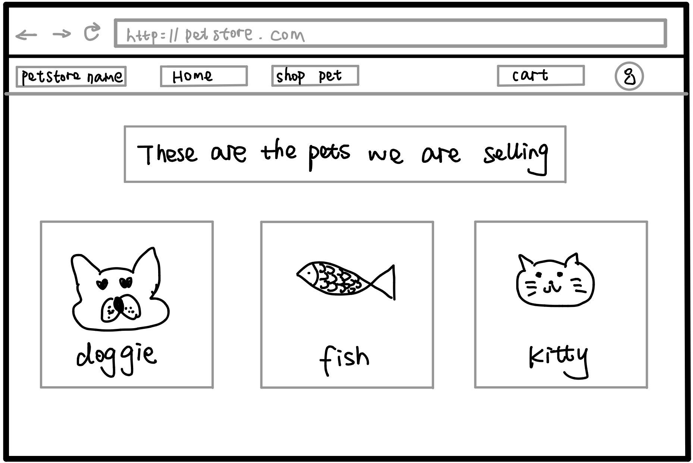

## Implemention - Front End/UX:

### Development

#### Prototyping (27/07/21-31/07/21)

For the project, our initial idea involved creating a login page, which is convienient for user to manage their own accounts. After the first discussion, we should achieve:

* Creating the initial prototype in order to give a direction for development
* Making the features of site
* Figure out what the customer needs

  

### Final front end design

